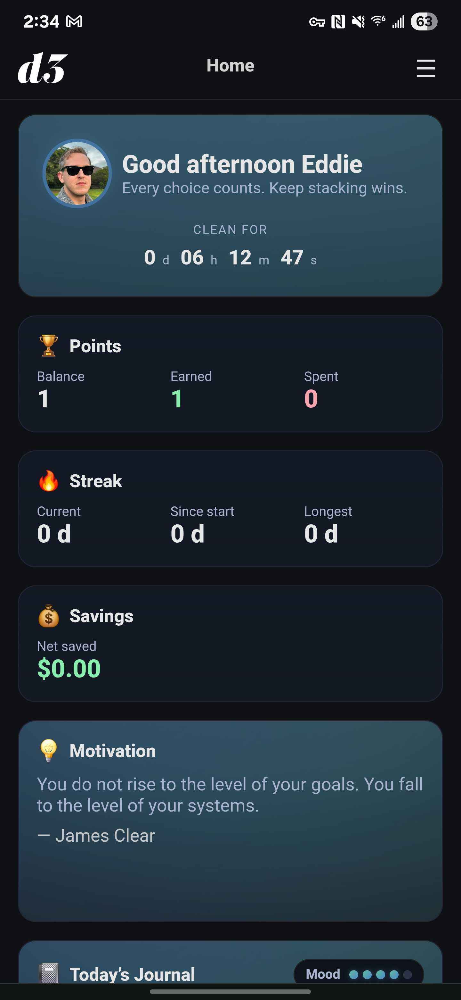
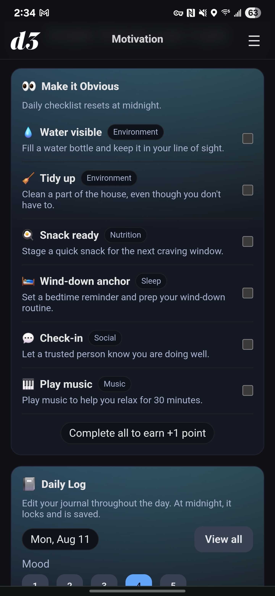
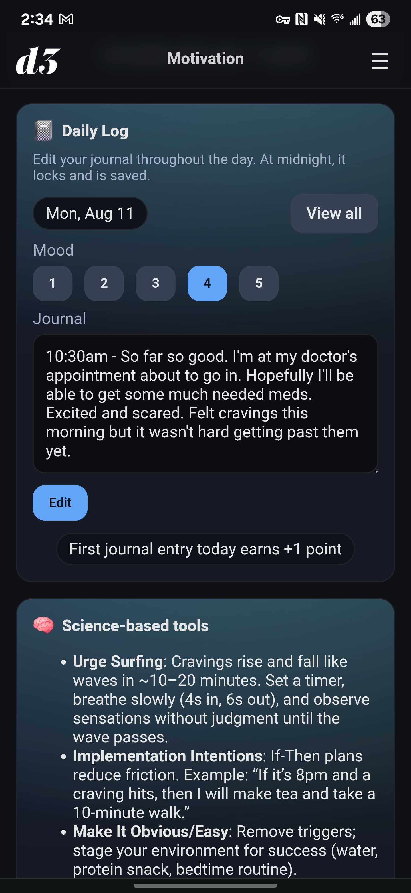
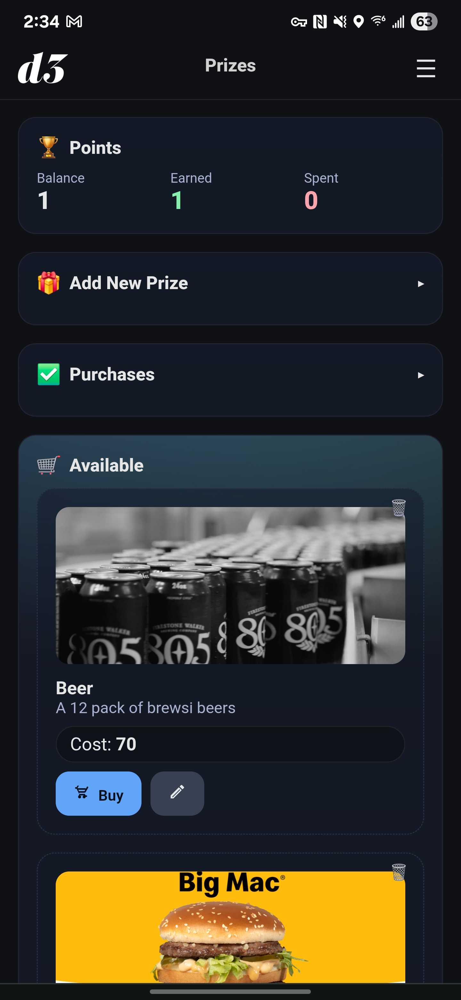
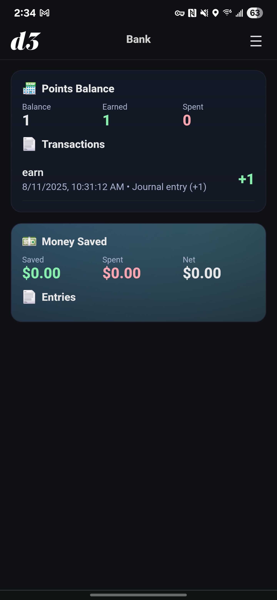

## D3 — Quit THC Tracker (Full‑Stack, Dockerized)

D3 helps you quit THC with daily logging, a unified sobriety timer, points, prizes, and motivation. It’s a React frontend with a Node/Express API and Postgres DB, packaged for easy home‑server deployment with Docker Compose.

### Screenshots







### Features
- Multi‑user accounts: username + 4‑digit PIN per user
- Setup & signup wizard: name, username, PIN, avatar, weekly spend
- Unified sobriety timers:
  - CLEAN FOR (seconds): exact time since the last use or setup completion
  - Streak (days): calendar days since the same clean start
  - Both timers share one “clean start” source and reset together when a use is logged
- Daily log: “Did you use today?” Yes/No with details and points
  - Clean day: +10 points and savings credit
  - Use day: −20 points; if paid, records spend amount
- Bank & savings:
  - Points balance, earned/spent totals, transaction history
  - Savings estimation (based on weekly spend), with money event history
- Prizes store: create prizes with images, purchase (deduct points), restock
- Motivation:
  - Quotes (curated pool, daily rotation)
  - Make It Obvious checklist (+1 if complete; −5 if missed at day rollover)
  - Breathing (1‑minute sessions): do 3 sessions in a day to earn +1 (resets at midnight; additional sessions give no extra points)
- Journal: today’s entry and mood; +1 point on first non‑empty entry of the day
- Mobile‑friendly UI; fixed top navbar; basic offline caching via service worker
- Admin tools (for the first user): backup/restore, full reset, list users, reset user PIN, delete user

### How sobriety timers work
- Clean start is derived as follows:
  - If you have any use logs: clean start = the exact timestamp of the most recent use (log creation time)
  - If you have no use logs: clean start = setup completion (`startDate`)
- CLEAN FOR counts exact time since clean start
- Streak shows full calendar days since the same clean start

### Tech Stack
- Frontend: React + Vite + TypeScript, React Router, Zustand
- Backend: Node + Express + TypeScript, JWT auth, Multer uploads
- Database/ORM: Postgres + Prisma
- Reverse proxy: Nginx (serves frontend and proxies `/api`)
- Deployment: Docker Compose

### Quick Start (Docker)
1. Create a `.env` at the repo root with at least:
   ```env
   POSTGRES_USER=d3
   POSTGRES_PASSWORD=change_me
   POSTGRES_DB=d3
   JWT_SECRET=change_me
   ```
2. Build and start services:
   ```bash
   ./deploy.sh
   ```
3. Open `http://localhost:7288` and complete the setup wizard.

Services:
- Web: `http://localhost:7288` (SPA; proxies `/api` to API)
- API: proxied by web at `/api` (direct `http://localhost:7289`)
- DB: Postgres (internal only)

### Points System
- Clean day (daily log No): +10
- Use day (daily log Yes): −20
- Make It Obvious checklist: +1 when completed; −5 if missed when day rolls over
- Breathing widget: +1 once per day upon completing 3× 1‑minute sessions (no extra points after 3)
- Journal: +1 on the first non‑empty entry of the day
- Prizes: cost points as configured; purchasing deducts that amount

### API Overview
- Auth/setup
  - `POST /api/setup` first‑time setup (creates the first admin user only)
  - `POST /api/auth/signup` create a new user (username + PIN + profile)
  - `POST /api/auth/login` login with `{ username, pin }` → JWT
  - `GET /api/me`, `PUT /api/me` profile CRUD (name, weekly spend, avatar, PIN, startDate)
- Daily logs, bank, savings
  - `POST /api/logs/daily` create a clean/use day; issues point transactions and money events
  - `GET /api/logs` list logs
  - `GET /api/bank/summary` points balance, totals, and transactions
  - `GET /api/savings` money saved/spent and net
- Prizes
  - `GET /api/prizes`, `POST /api/prizes`, `PUT /api/prizes/:id`, `DELETE /api/prizes/:id`
  - `POST /api/prizes/:id/purchase`, `POST /api/prizes/:id/restock`
- Motivation & journal
  - `GET /api/motivation/quotes`, `GET /api/motivation/random`
  - `POST /api/motivation/checklist/score` (+1 complete or −5 missed)
  - `POST /api/motivation/urge/complete` (+1 when client awards; used after 3× 1‑min sessions)
  - `GET /api/motivation/breath/status` (today’s breathing count)
  - `POST /api/motivation/breath/record` (record a 1‑min session; awards +1 on 3rd)
  - `GET /api/journal/today`, `PUT /api/journal/today`, `GET /api/journal`
- Admin & binary media
  - `GET /api/admin/users` list users (admin only)
  - `POST /api/admin/users/:id/reset-pin` set/reset a user PIN (admin only)
  - `DELETE /api/admin/users/:id` permanently delete a user and all data (admin only)
  - `POST /api/admin/reset` wipe all data (admin only)
  - `GET /api/admin/backup`, `POST /api/admin/restore` (admin only)
  - `GET /api/users/:id/avatar`, `GET /api/prizes/:id/image`

All endpoints except `/api/setup`, `/api/auth/signup`, and `/api/auth/login` require `Authorization: Bearer <token>`.

### Data Model (Prisma)
- `User` (with `username`, `isAdmin`)
- `DailyLog`, `Transaction`, `Prize`, `Purchase`, `MoneyEvent`, `MotivationQuote`
- `BreathDaily` (tracks daily 1‑min breathing sessions per user)

### Images & Uploads
- Avatars and prize images are stored under `api/uploads/` and served via static routes.

### Environment
Create `.env` in the repo root. Important variables:
- `POSTGRES_USER`, `POSTGRES_PASSWORD`, `POSTGRES_DB`
- `JWT_SECRET`
- `DATABASE_URL` is set automatically inside Docker; for local dev set it under `api/.env` as needed

### Development
The project is designed to run in Docker by default. Optional local dev:

Backend:
```bash
cd api
npm install
npx prisma migrate dev
npm run dev
```

Frontend:
```bash
cd web
npm install
npm run dev
```

If not using Nginx locally, set `VITE_API_URL` in `web/.env.local` to your API base.

### Deploy script
`deploy.sh` builds images, runs migrations, and brings the stack up. Re‑run after pulling updates.

### Versioning
This is D3 v1.0.0.

### License
MIT


